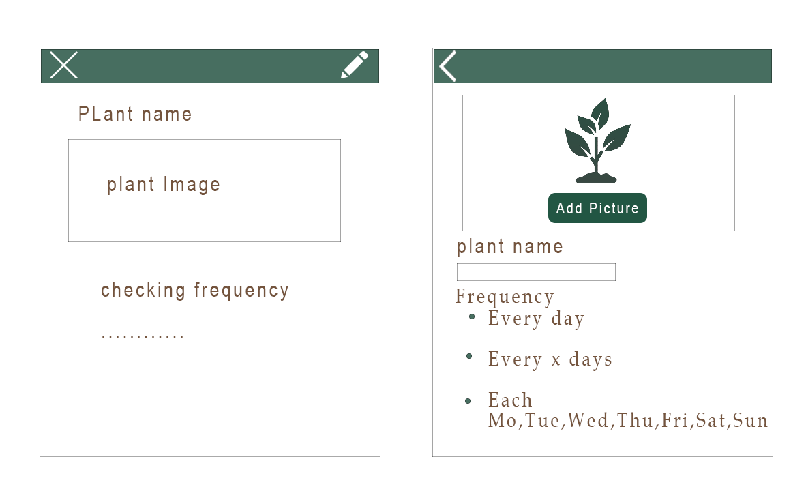

# IOT-project
**Het idee**

Het IoT project dat ik heb gebouwd voor het vak data science voor IoT is een plantmonitoring systeem.
Het idee is dat ik een grondvochtigheid sensor aan een rasberry pi koppel en dat ik daarmee kan controleren of een plant water nodig heeft, vervolgens wilde ik de data die ik van de rasberry pi krijg, in een app verwerken. Het idee van de app is dat die de gebruiker laat kiezen hoevaak hij/zij wil dat de app gaat checken of de plant water nodig heeft. Als de plant water nodig heeft dan krijgt de gebruiker een notificatie.

**Benodigdheden**
- Raspberry pi 4
- Grondvochtigheid sensor
- Dreadbord
- Female to male jumper draden
- Android smartphone
- Internetverbinding
- Android studio (voor android development)
- Python

**IoT device en sensor**

De eerste stap die ik heb genomen bij het bouwen van mijn project, was een grondvochtigheid sensor op een raspberry pi aansluiten en kijken of er water te vinden is. Ik heb de sensor door middel van GPIO pinnen en een breadbord aangesloten op de raspberry pi. Hieronder vindt u een foto van hoe ik de sensor heb aangesloten op de raspberry pi.

**Data uit de sensor lezen met python**

Nadat ik de sensor heb aangesloten op de raspberry pi, heb ik een script geschreven om de data uit de sensor te lezen. De script leest elke 5 minuten de data uit de sensor. Toen dit gelukt was, was het tijd om de data van de sensor op thingspeak te zetten. Daarvoor was een internetverbinding nodig, dus ik heb de raspberry pi met de wifi verbonden. 

**Thingspeak**

Om verder gebruik te kunnen maken van de data uit de sensor, heb ik thingspeak gebruikt. Thingspeak is een IoT platform die je kan gebruiken om data van je sensor op te slaan, daarnaast kan je op thingspeak een overzicht krijgen van je data d.m.v. grafieken. Via een python script stuur ik elke 5 minuten de data van mijn sensor naar thingspeak. (Het script is in mijn repository te vinden in de folder “Raspberry_pi”)

[Klik hier voor mijn repository op thingspeak](https://thingspeak.com/channels/1029560)

**Android Applicatie**

Nadat het gelukt was om data op thingspeak te zetten, was het tijd om aan de android applicatie te beginnen. Om te beginnen heb ik ontwerpen gemaakt voor de pagina’s van app. 
Hieronder kunt u de ontwerpen van de app zien:

Voor de applicatie heb ik android studio gebruikt. Als de gebruiker voor het eerst de app gebruikt, komt hij/zij op een pagina waarop die de plant kan toevoegen. De gebruiker kan dan een naam geven aan de plant, een foto toevoegen en een uit de volgende opties kiezen voor hoe vaak de app moet checken of de plant water nodig heeft: 
-	Elke dag.
-	Elke x aantal dagen.
-	Dagen van de week (bijv. elke dinsdag)

Alle gegevens van de plant worden in een lokale sqlite database opgeslagen.  Op de achtergrond checkt de app of de plant water nodig heeft, dat gebeurt met een GET request naar thingspeak waarmee sensor data wordt opgehaald. Als de plant water nodig heeft dan krijgt de gebruiker de volgende notificatie.
Op de homepagina kan de gebruiker de gegevens van de plant zien. Ook kan die de gegevens van de plant aanpassen.
